  

  

  

    
    
    
  

 

  

 

  
    
  

<h2>🧰 Creative Toolkit</h2>

  

 

  
  
  

<h2>🌍 Find Me Around the Web</h2>

  
  
  

 

  <h3><em>Learn with curiosity · Create with purpose · Serve with joy</em></h3>
  

